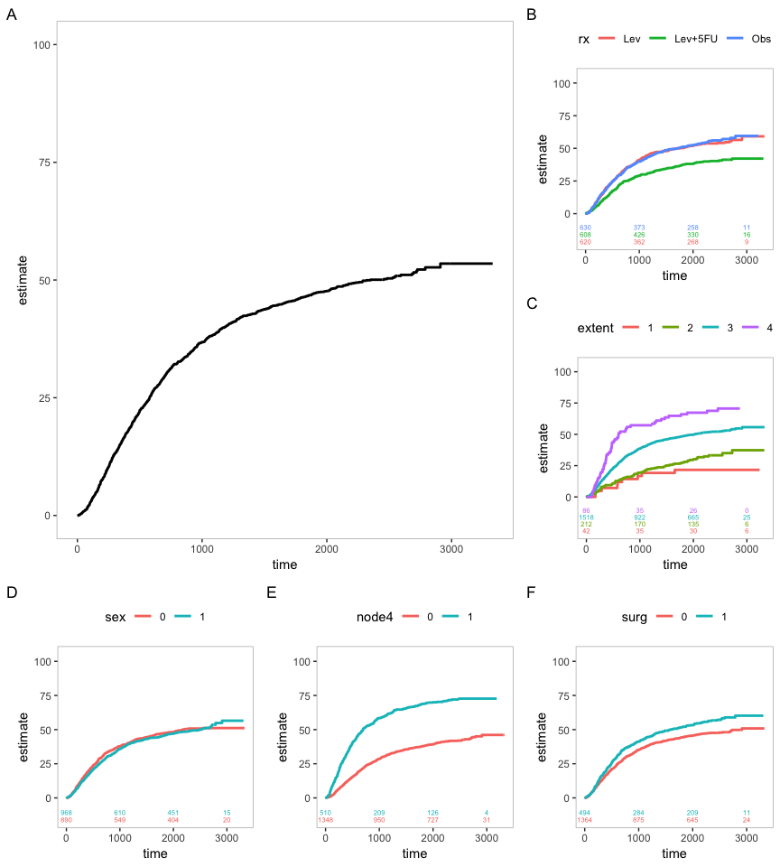

# survsup 

This is a package for R that provides functionality to plot beautiful survival curves (with numbers at risk table).
Based upon the ggplot2 package, it provides large flexibility, yet a straightforward and easy syntax. It is under
development. Please report any issues. 

An example: 

<!-- -->


Install the package like this:

```r
install.packages("devtools") # Can be omitted if already installed
devtools::install_github("dlindholm/survsup", build_vignettes = TRUE)
```

For detailed instructions on how to use the package, please refer to the Vignette.
```r
library(survsup)
vignette("survsup_intro")
```